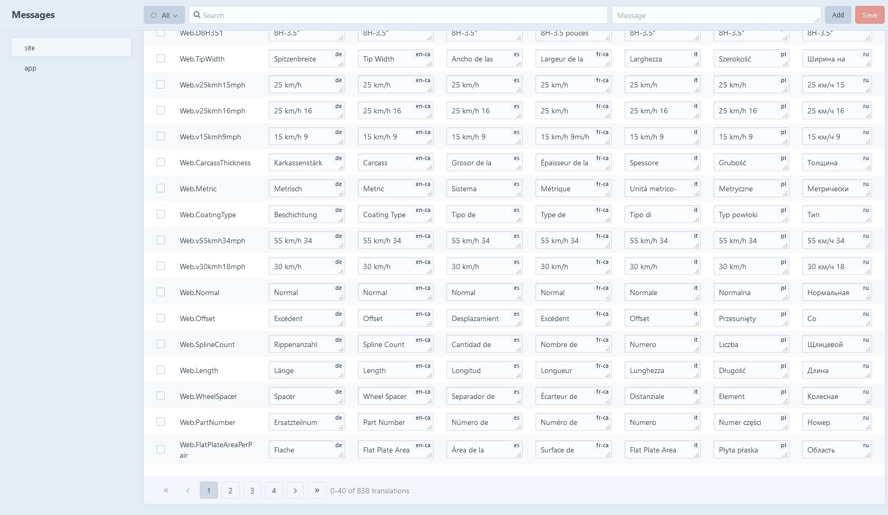

# Translations admin plugin for Craft CMS

This plugins adds a control panel interface to edit your static translations in the database. 



## Features

- Add, edit or delete translations in the Control Panel with each language side by side.

- Filter missing translations and search by keywords.

- Configure which translations categories you'll be able to edit.

- Translations will be kept inside your database instead of PHP files.

- When a page is visited on the site, missing translations will automatically be added.

- Export your translations to a CSV file and import it back after handing it to your translation team.

- GraphQL support to query static messages

- Utilities:

    - Parse all site templates to add missing translations
    - Migrate your existing PHP site translations to your database
    - Export all your database translations to PHP files
    - Delete all translations

## Requirements

This plugin requires Craft CMS 3.1.0 or later.

## Installation

Install the plugin via the **Plugin Store** or by command line:
```
composer require mutation/translate
php craft install/plugin translations-admin
```

You can now edit your translations in the control panel `/admin/translations-admin`.

## Permissions

You have special permissions for the Translations admin plugin:
- Update translations
- Export translations
- Import translations
- Use utilities
- Change settings

## Settings

You can either go the **settings page** or create a file `translations-admin.php` in your `config` directory.

- **Plugin Name**: How the plugin should be named in the CP
- **Categories**: Choose the source message categories you want to have in your database and control panel.
- **Add missing translations**: Controls whether missing translations are automatically added to the database when a page is visited.
- **Add missing translations for site request only**: Controls whether missing translations are only added when the request is from the site.

Config file example:
```
<?php

return [
    'pluginName' => 'Translations',
    'categories' => [
        ['category' => 'site']
        ['category' => 'app']
    ],
    'addMissingTranslations' => false,
    'addMissingSiteRequestOnly' => false
];
```

## GraphQL

Query static messages this way:
```
{
  staticMessages(language:["en-CA", "fr-CA"], category: ["site", "app"]) {
    key
    message
    language
    category
  }
}
```

## Roadmap

- Add mapping for the import and support more format (Excel)
- Refresh/sync option for the translations overview
